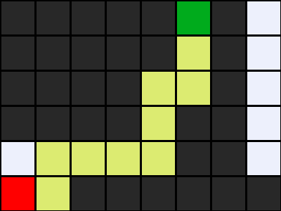
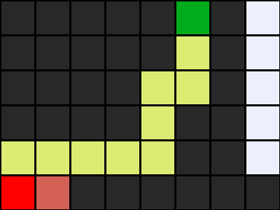

# 🧭 AI Maze Search Solver — Exploring DFS and BFS Algorithms
[]()
[](LICENSE)
[]()

This project explores AI search algorithms through maze-solving using Python.
Inspired by Harvard’s CS50 Introduction to Artificial Intelligence with Python (Lecture 0: Search),
it demonstrates how agents reason, navigate, and reach goals efficiently using Depth-First Search (DFS) and Breadth-First Search (BFS) strategies.
The work focuses on understanding frontier management, goal testing, and algorithmic trade-offs between exploration depth and optimality.

---

## 🎯 Project Overview
The program reads a `.txt` maze file where:
- `A` → represents the **start point**
- `B` → represents the **goal**
- `#` → represents **walls**
- spaces `" "` → represent valid paths

It builds a **state-space graph** and applies either **DFS** or **BFS** to find the path from `A` to `B`.

---

## 🧩 Example Maze

```text
#####B#
##### #
####  #
#### ##
     ##
A ######
```
Run the solver using the sample [maze1.txt](maze1.txt).


### DFS Result (StackFrontier)
Depth-First Search explores one branch completely before backtracking.  
It may find a solution quickly, but **not always the shortest path**.



> Uses a **StackFrontier (LIFO)** structure.

---

### BFS Result (QueueFrontier)
Breadth-First Search explores all directions evenly, level by level.  
It **always finds the shortest path**, though it can use more memory.



> Uses a **QueueFrontier (FIFO)** structure.

---

## ⚖️ StackFrontier vs QueueFrontier

| Feature | **StackFrontier (DFS)** | **QueueFrontier (BFS)** |
|----------|-------------------------|--------------------------|
| Data Structure | Stack (LIFO) | Queue (FIFO) |
| Exploration | Deep-first | Level-by-level |
| Optimal Solution | ❌ Not guaranteed | ✅ Always shortest |
| Memory Use | Lower | Higher |
| Ideal Use | Quick exploration | Pathfinding accuracy |

Both algorithms share the same logic — the difference lies in how the `remove()` method retrieves the next node to explore.

---

## 📚 Key Concepts Learned from CS50 AI Lecture 0
- **Agent** and **state-space representation**  
- **Actions**, **transition models**, and **goal testing**  
- **Frontier and explored set** management  
- **DFS** and **BFS** algorithm comparison  
- Visualization of AI search behavior  

(*Reference: Harvard CS50 AI Lecture 0 – Search, pages 3–8.*)

---

## ⚙️ How to Run

1. ## 💻 **Clone this repository:**
   ```bash
   git clone https://github.com/YOUR-USERNAME/ai-maze-search.git
   cd ai-maze-search
   
2. ## 🧩 Run the maze solver: 
 ```bash
python maze.py maze1.txt
```

3. ## ⚙️ (Optional) Switch algorithms in the code:
```bash
frontier = StackFrontier()   # DFS
# or
frontier = QueueFrontier()   # BFS
```

## 🧱 Folder Structure

```text
ai-maze-search/
├── maze.py
├── maze1.txt
├── assets/
│   ├── dfs_maze_solution.png
│   └── bfs_maze_solution.png
└── README.md

```

---

## 🧠 What I Learned
- How AI agents search through state spaces using **logic, not data**.  
- The difference between **uninformed search strategies (DFS vs BFS)**.  
- The effect of frontier order (**Stack vs Queue**) on exploration and performance.  
- The importance of **goal testing and node expansion** in AI reasoning.

---

## 🎓 Educational Context
This project was completed as part of my **Harvard CS50 AI coursework** to deepen my understanding of **search algorithms and AI reasoning foundations**.  
It serves as a key step in my path toward mastering **Artificial Intelligence and Machine Learning Engineering**.

---

## 🏆 Author
**Gabrielle Rodrigues**  
AI Engineer | Machine Learning | Search Algorithms | Data Science  
📍 Tennessee, USA
🔗 [LinkedIn](https://www.linkedin.com/in/grdrgs/) • [GitHub](https://github.com/Gabxrielle)

---

## 🧾 License
This project is part of the **Harvard CS50 AI** curriculum and is reproduced for educational purposes under the **MIT License**.

---

## 🌿 Credits
Based on **CS50’s Introduction to Artificial Intelligence with Python – Lecture 0: Search**  
© Harvard University | David J. Malan & Brian Yu (OpenCourseWare)
